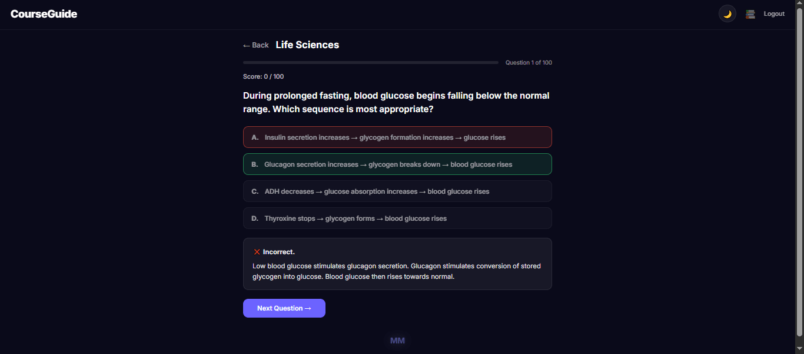

# 📘 CourseGuide

CourseGuide is a free, purely JavaScript-based exam revision platform built to help South African Matriculants prepare for their NSC examinations. It provides up to **200 multiple-choice questions per subject**, complete with instant feedback, accurate answers, and concise explanations — helping Grade 12 students revise as effectively as possible for their final exams.

<p align="center">
  
</p>

---

## ✨ Features

- **200 questions per subject** — practice in small sets or run a full revision session
- **Instant feedback** — see whether you got it right the moment you answer
- **Concise explanations** — learn the reasoning behind every answer
- **Six core subjects** — Mathematics, Business Studies, Accounting, Physics, Life Sciences, Geography
- **CAPS-aligned** — matches the South African school syllabus
- **Simple login** — no signup, no backend, just open and revise
- **Results screen** — final score plus a full question-by-question review
- **Two themes** — dark Glassmorphism and a light blue theme
- **Fully responsive** — works on desktop, tablet, and mobile
- **Zero dependencies** — pure HTML, CSS, and JavaScript, no frameworks or build tools
- **Deploys anywhere static** — Vercel, Render, GitHub Pages, Netlify

---

## 📚 Subjects Covered

| Subject | Questions |
|---|---|
| Mathematics | Up to 200 |
| Business Studies | Up to 200 |
| Accounting | Up to 200 |
| Physics | Up to 200 |
| Life Sciences | Up to 200 |
| Geography | Up to 200 |

---

## ⚠️ Disclaimer

The questions on this platform are **not** a rip-off of the regulated DBE guidelines, and they are **not** the actual NSC exam questions. They are **original revision questions** designed to help students practice the concepts and skills tested in the Matric examinations.

---

## 🚀 Getting Started

### 1. Clone the Repository

```bash
git clone https://github.com/MawandeM-98/CourseGuide.git
cd CourseGuide
```

### 2. Open in Your Browser

Simply open `index.html` in your browser — no install, no build step, no dependencies.

### 3. Log In

Use the demo credentials:

```
Username: learner
Password: learner123
```

### 4. Start Revising

- Read through the welcome screen
- Pick a subject
- Answer questions and get instant feedback
- Review your final score at the end

---

## 🛠 Tech Stack

| Tool | Purpose |
|---|---|
| **HTML5** | Structure |
| **CSS3** | Theming (Glassmorphism + light blue), responsive layout |
| **Vanilla JavaScript** | Quiz engine, subject data, app logic |

No frameworks. No build tools. No backend.

---

## 📁 Project Structure

```
CourseGuide/
├── index.html              # App entry point
├── css/
│   └── styles.css          # All styles + both themes
├── js/
│   ├── main.js             # App init, subject config, registry
│   ├── quiz-engine.js      # Shared quiz logic
│   └── subjects/           # One file per subject
│       ├── mathematics.js
│       ├── business-studies.js
│       ├── accounting.js
│       ├── physics.js
│       ├── life-sciences.js
│       └── geography.js
├── screenshot.png          # Preview image
└── README.md
```

> Adjust the file tree to match your actual folder names.

---

## 🧠 How It Works

- **Subject files** — each subject lives in its own file under `js/subjects/`, containing its question bank
- **Quiz engine** — a shared engine handles question flow, scoring, feedback, and review for every subject
- **Registry** — subjects are registered globally so the engine can load them dynamically
- **Config** — `main.js` holds the subject configuration and app initialization
- **Themes** — a single stylesheet supports both the dark Glassmorphism theme and the light blue theme

---

## ☁️ Deployment

CourseGuide is a **static site** and deploys to any static host.

### Vercel

1. Push the project to GitHub
2. Go to [vercel.com/new](https://vercel.com/new)
3. Import the repo
4. Framework preset: **Other**
5. Deploy

### Render

1. Push the project to GitHub
2. Go to [render.com](https://render.com)
3. New → **Static Site**
4. Connect the repo
5. Build command: *(leave empty)*
6. Publish directory: `/` (or the root)
7. Deploy

### GitHub Pages

1. Push the project to GitHub
2. Settings → Pages
3. Source: **Deploy from a branch**
4. Branch: `main` / `root`
5. Save

---

## 🤝 Contributing

Contributions are welcome!

### Add or update questions

1. Open the relevant file under `js/subjects/`
2. Follow the existing question format
3. Submit a pull request

### Add a new subject

1. Create a new file under `js/subjects/`
2. Register it in the global registry
3. Add the subject to the configuration in `main.js`
4. Submit a pull request

---

## 🗺 Roadmap

- [ ] Add more subjects (Physical Sciences, History, Economics)
- [ ] Timed exam mode
- [ ] Progress tracking with `localStorage`
- [ ] Difficulty levels per question
- [ ] Flashcard mode for key concepts
- [ ] Export results as PDF
- [ ] Afrikaans and isiZulu translations

---

## 📄 License

This project is licensed under the **MIT License**.

---

## 🙏 Acknowledgments

- Built for South African Matriculants preparing for the NSC examinations
- Aligned with the CAPS syllabus
- Inspired by the need for free, accessible revision tools

---

All the best with your Matric exams. Study hard, revise smart, and enjoy the journey. 🎓